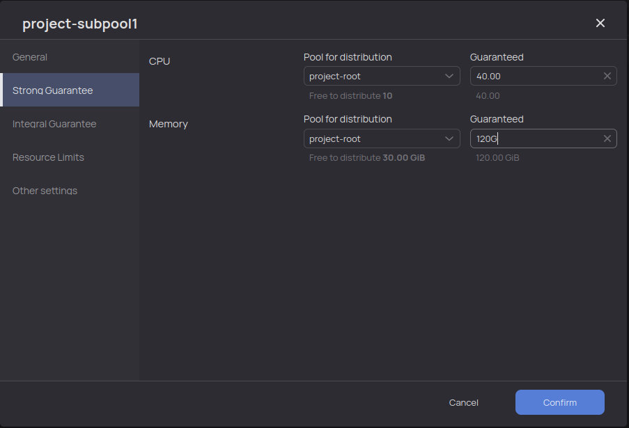

# Управление вычислительными пулами

В данном разделе рассказано о том, как создавать пулы, управлять ресурсами и настройками вычислительных пулов в системе {{product-name}} на примере CLI и веб-интерфейса.

## Общие сведения { #common }

В системе {{product-name}} реализована возможность управлять вычислительными пулами, поддерживаются такие действия с пулами, как:

- создание;
- переименование;
- перемещение;
- удаление;
- изменение настроек.

Изменение настроек вычислительного пула осуществляется путём редактирования соответствующих атрибутов пула. Доступные атрибуты для редактирования пользователем:

* `weight` — управляет долей ресурсов родительского пула, которая будет доставаться текущему пулу;
* `max_operation_count` — ограничение на число выполняющихся (`running`) операций и операций в очереди (`pending`);
* `max_running_operation_count` — ограничение на число выполняющихся (`running`) операций;
* `strong_guarantee_resources` — словарь, описывающий гарантированные ресурсы пула;
* `forbid_immediate_operations` — запрет на запуск операций непосредственно в данном пуле;
* `mode` — способ распределения ресурсов между операциями в пуле;
* `fifo_sort_parameters` — управление очередностью запуска операций в fifo-пулах;
* `resource_limits` — словарь, задающий верхние ограничения для ресурсов, доступных пулу;
* `create_ephemeral_subpools` — разрешает создавать виртуальные пулы;
* `ephemeral_subpool_config` — словарь, описывающий конфигурацию виртуальных пулов;
* `integral-guarantees` - интегральные гарантии.

Подробное описание указанных атрибутов в разделе [Характеристики пулов](../../../../user-guide/data-processing/scheduler/pool-settings.md#pools).

### Валидация

При валидации система {{product-name}} проверяет типы атрибутов, ограничение `max_operation_count >= max_running_operation_count`, количество тегов в списке `allowed_profiling_tags` (не более 200), отсутствие подпулов в fifo-пулах и согласованность гарантий на ресурсы.

Согласованность гарантий на ресурсы означает, что по каждому ресурсу сумма гарантий потомков не должна превышать гарантию родителя. Если на подпуле выставлена ненулевая гарантия на некоторый ресурс, то она должна быть выставлена и у родителя. При этом допускается, что у пула ненулевая гарантия выставлена на более, чем одном ресурсе.

## Управление пулами через CLI { #cli }

Создание подпула:

```bash
yt create scheduler_pool --attributes='{pool_tree=physical;name=project-subpool1;parent_name=project-root}'
```

В attributes можно дополнительно передать атрибуты пула, они будут провалидированы. В случае неуспешной валидации объект создан не будет.

Пример изменения веса для созданного пула:

```bash
$ yt set //sys/pool_trees/physical/project-root/project-subpool1/@weight 10
```

Первичное выставление гарантии пула при условии, что у родителя имеется нераспределенная гарантия:

```bash
$ yt set //sys/pool_trees/physical/project-root/project-subpool1/@strong_guarantee_resources '{cpu=50}'
```

Для изменения уже выставленной гарантии можно изменить конкретный параметр:

```bash
$ yt set //sys/pool_trees/physical/project-root/project-subpool1/@strong_guarantee_resources/cpu 100
```

Перемещение производится стандартным образом:

```bash
$ yt move //sys/pool_trees/physical/project-root/project-subpool1 //sys/pool_trees/new-project/new-subpool
```
Переименование через перемещение поддерживается.
При перемещении происходит валидация.

Атрибуты выставляются стандартным образом:

```bash
$ yt set //sys/pool_trees/my_pool_tree/project_pool/@max_operation_count 10
```
При выставлении атрибутов происходит валидация.

## Управление пулами через веб-интерфейс { #ui }

Управление пулами в веб-интерфейсе осуществляется в разделе `Scheduling`.

Для создания подпула необходимо перейти в родительский пул, нажав на его имя. Далее нужно нажать кнопку `Create pool` и заполнить все обязательные поля в форме, после этого нажать `Confirm`.

Пример формы по созданию пула представлен на рисунке.


Для редактирования настроек пула необходимо нажать на карандаш в строке с именем пула в правой части экрана как показано на рисунке.


Настройки пула, доступные для редактирования, разделены на группы. На рисунках приведены примеры общих настроек и гарантированных ресурсов соответственно.




В разделе `Resource Limits` можно выставить верхнее ограничение для пула, если, например, необходимо, чтобы пул не выходил за потребление в 100 ядер. По умолчанию верхнего ограничения для пулов не существует, доступные пулу ресурсы ограничены мощностью кластера.

В разделе `Other Settings` приведены дополнительные настройки, в частности запрет на запуск операций в пуле.



Обратите внимание, что операции рекомендуется запускать именно в листьях дерева пулов, то есть в тех пулах, у которых нет подпулов. В таком случае полезно явно выставлять запрет на запуск операций непосредственно в данном пуле.

В узлах дерева пулов (в пулах, имеющих подпулы) запускать операции не следует, в противном случае сложнее расследовать различные проблемы при распределении ресурсов между пулами и операциями.


